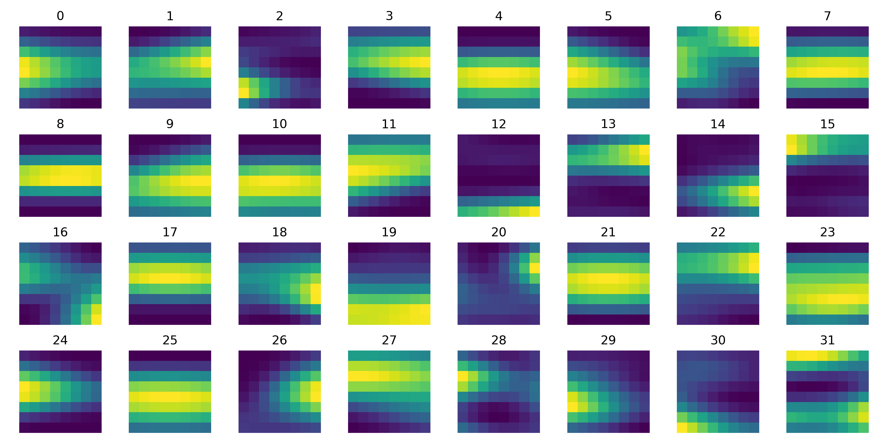

# NRAO Jets GMM Prior

## Input Data

- The PR image was downloaded from https://public.nrao.edu/gallery/quicklook-samples/
- The pre-processing involves aligning all jets with the horizontal axes

## GMM v0.1 Overview
### Gaussian Means Images

### Gaussian Covariance Eigen Images
